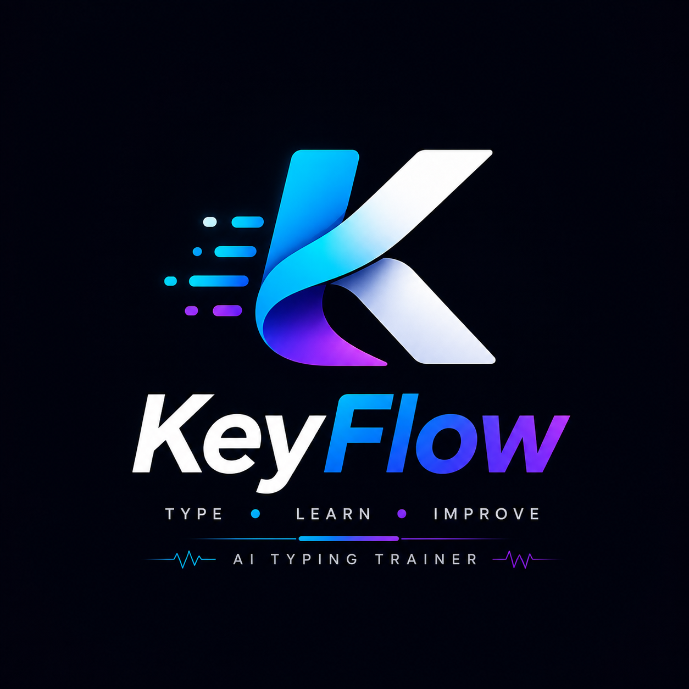

<div align="center">
  
  <h1>KeyFlow AI Typing</h1>
  <p><strong>Advanced, Offline-First, Local AI Typing Engine & Learning Workspace</strong></p>

  <!-- Badges -->
  <p>
    
    
    
    
  </p>
</div>

<br/>

## 📖 Table of Contents
- [About KeyFlow](#-about-keyflow)
- [Key Features](#-key-features)
- [Multi-Agent Pipeline](#-multi-agent-pipeline)
- [Project Sprints (Roadmap)](#-project-sprints-roadmap)
- [Installation & Running](#-installation--running)
- [Building for Production](#-building-for-production)
- [Privacy & Security](#-privacy--security)
- [Contributing](#-contributing)

---

## ⚡ About KeyFlow

Most typing platforms measure Speed (WPM) and Accuracy as a generic aggregate across an entire session. **KeyFlow is fundamentally different.** 

KeyFlow captures data at the **micro-keystroke level**, recording precise `t -> h` transition bottlenecks, right/left-hand imbalances, and rhythm variances. Built upon a deterministic local agent pipeline and a beautiful glassmorphism interface, KeyFlow acts as your private, hyper-analytical typing coach.

**Core Philosophy: Zero Cloud Dependency.** 
Everything—from telemetry storage to AI-driven curriculum generation—runs entirely on your local machine.

---

## ✨ Key Features

- **Micro-Telemetry Engine:** High-resolution `performance.now()` latency tracking for every keystroke.
- **Glassmorphism UI:** A bespoke, 60fps, responsive dark-mode interface powered entirely by Vanilla CSS. No heavy frontend frameworks.
- **20-Lesson Master Curriculum:** A progressive learning path spanning basic Home Row anchors, advanced digraph rolls, and complex programming syntaxes (`[]{}&&||`).
- **Dynamic Difficulty Controller:** A mathematical gating mechanism that automatically unlocks higher speed targets only when strict accuracy consistency (97%+) is achieved.
- **Interactive Keyboard Map:** A real-time visual heat map and keystroke tracker.
- **Encrypted Local Backups:** Full SQLite data dumps are symmetrically encrypted using AES-256 (`cryptography.fernet`) to secure your keystroke dynamics at rest.

---

## 🤖 Multi-Agent Pipeline

KeyFlow's local decision engine uses a strict sequence of specialized, deterministic agents that pass structured state forward.

1. **`PerformanceAnalyst`**: Analyzes telemetry to calculate WPM, accuracy, and identify erratic rhythm states.
2. **`WeaknessDetector`**: Isolates specific expected-key bottlenecks.
3. **`CurriculumPlanner`**: Selects the absolute best next-focus area for the learner.
4. **`DifficultyController`**: Modulates the WPM and Accuracy gates based on historical trends.
5. **`Coach`**: Builds the mathematical, deterministic recommendation.
6. **`PrivacyGuard`**: A pre-processing agent that meticulously strips PII (usernames, local paths) from the payload.
7. **`LLMCoach` (Optional)**: Connects to a local instance of Ollama to synthesize the deterministic output into an engaging, highly personalized message.
8. **`Validator`**: Ensures all agent outputs meet strict schema and safety requirements before rendering to the UI.

---

## 🚀 Project Sprints (Roadmap)

KeyFlow was developed in three rigorous stages:

### Sprint 1: Typing Intelligence
- [x] High-resolution telemetry tracking setup.
- [x] SQLite blob storage for infinite-length telemetry arrays.
- [x] Deterministic heuristic analysis to calculate precise `t -> h` transition delays.

### Sprint 2: Adaptive Learning & Premium UI
- [x] Comprehensive 20-Lesson master sequence.
- [x] Advanced Difficulty Gating logic based on historical mastery.
- [x] Premium glassmorphism UI overhaul with dynamic keycap lighting.

### Sprint 3: Local AI Coaching & Production Packaging
- [x] Integration of the `PrivacyGuard` and `LLMCoach` (Ollama localhost abstraction).
- [x] `SecureBackupEngine` implementation using `cryptography` for encrypted data exports.
- [x] Production `build.spec` using PyInstaller for standalone, zero-dependency desktop executables.
- [x] Complete CI/CD GitHub Actions pipeline.

---

## 🛠️ Installation & Running

### Requirements
- Python 3.11+
- Windows / macOS / Linux
- [Ollama](https://ollama.com/) (Optional: Only required if using the Generative AI Coach)

### Run from Source

1. **Clone the repository**
   ```bash
   git clone https://github.com/your-username/keyflow-local.git
   cd keyflow-local
   ```

2. **Set up virtual environment**
   ```bash
   python -m venv .venv
   # Windows:
   .venv\Scripts\activate
   # macOS/Linux:
   source .venv/bin/activate
   ```

3. **Install Dependencies**
   ```bash
   pip install -r requirements.txt
   ```

4. **Launch the Application**
   ```bash
   python run.py
   ```

*(If Ollama is running on `localhost:11434` with the default model, the AI Coach will automatically engage. Otherwise, it safely falls back to the deterministic coach).*

---

## 📦 Building for Production

To distribute KeyFlow as a standalone `.exe` without requiring users to install Python, use the bundled PyInstaller specification.

1. **Install PyInstaller**
   ```bash
   pip install pyinstaller
   ```

2. **Run the Build Process**
   ```bash
   pyinstaller build.spec --clean -y
   ```

The compiled standalone executable will be generated inside the `dist/` directory.

---

## 🧪 Testing

Run the full integration test suite to validate the Multi-Agent pipeline, the difficulty controller logic, and the encryption engine.

```bash
python -m unittest discover
```

---

## 🛡️ Privacy & Security

KeyFlow operates on a **Zero-Trust** basis with telemetry data.
- **No Cloud Trackers**: There are zero API calls made to remote servers. The application works completely off-grid.
- **Sanitization Checkpoints**: The `PrivacyGuard` acts as an absolute boundary, preventing identifiable local data from being fed into the LLM context window.
- **Encrypted Exports**: When you export your profile, it is AES-256 encrypted to prevent malicious actors from accessing your keystroke timings (which can sometimes be used to deanonymize users).

---

## 🤝 Contributing

Contributions are welcome! Please follow these steps:
1. Fork the repository.
2. Create your feature branch (`git checkout -b feature/AmazingFeature`).
3. Adhere strictly to the project's **Deterministic-First** local privacy guidelines.
4. Run the test suite (`python -m unittest discover`).
5. Commit your changes (`git commit -m 'Add some AmazingFeature'`).
6. Push to the branch (`git push origin feature/AmazingFeature`).
7. Open a Pull Request.

---

<div align="center">
  <p>Built with precision by the KeyFlow AI Meta-Agents.</p>
</div>
